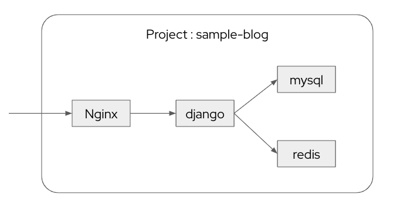
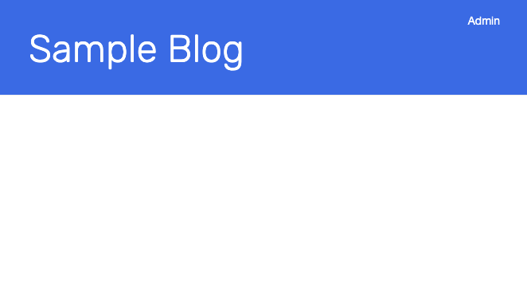
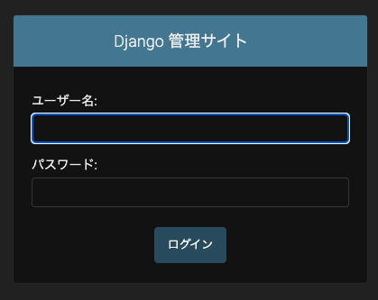
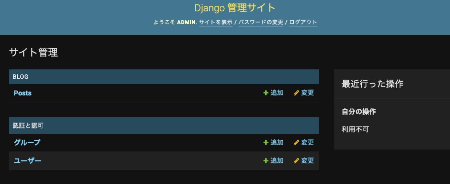
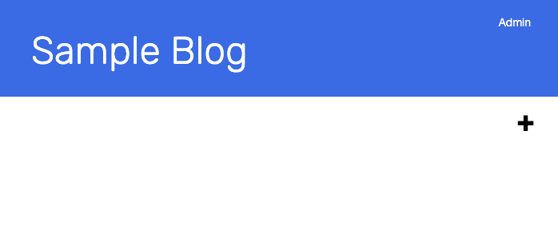
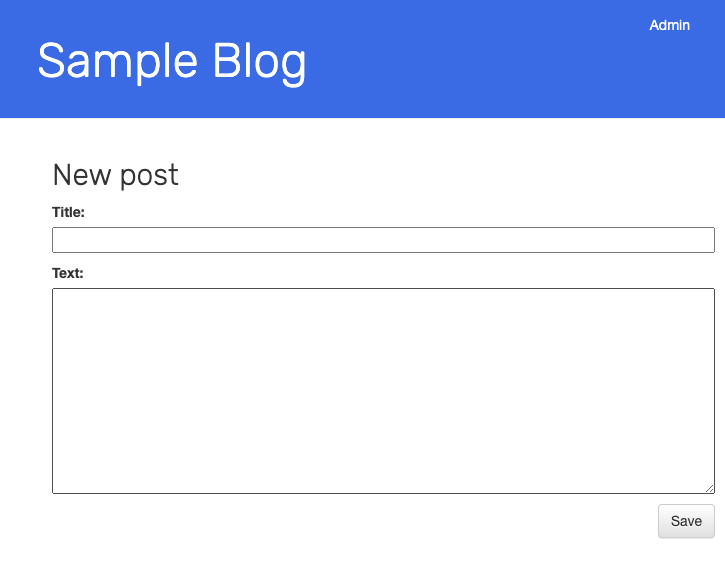
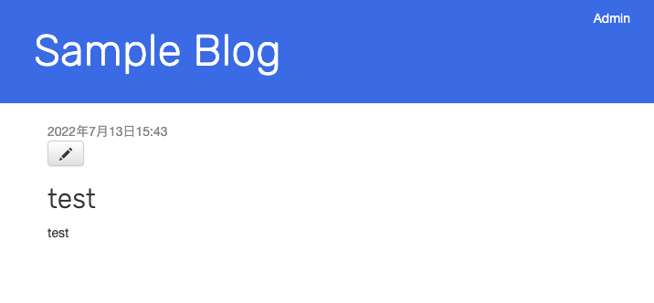
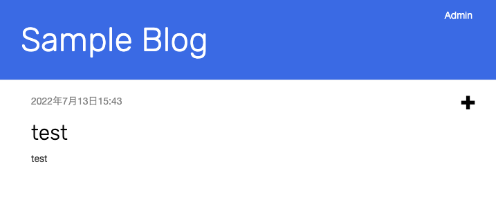

# はじめに
このアプリケーションはOpenShift上で動作するサンプルブログです。

※サンプルアプリは[Django Girlsのチュートリアル](https://tutorial.djangogirls.org/ja/)をベースに多少編集を施したものになります。
Web+APP+DBの一般的なWeb3層アプリになっています。



ここではアプリケーションのデプロイ手順と操作方法をまとめます。

# 前提条件
* OpenShift 4.10 (要Subscription)
* cluster-admin権限を持つUser


# デプロイ手順
Git cloneします。
```
git clone https://github.com/skitamura7446/sample-blog.git
cd sample-blog
```

OpenShiftにログインしてProjectを作成します。
```
oc new-project sample-blog
```

NginxとDjangoのコンテナをビルドします。
```
oc new-build --name=nginx --strategy=docker --binary
oc start-build nginx --from-dir=./docker/nginx/
oc new-build --name=django --strategy=docker --binary
oc start-build django --from-dir=./docker/django/
```

nginx-route.yamlを作成します。
```
cd k8s/base/
./entrypoint.sh
```

デプロイします。
```
oc apply -k .
```

RouteのURLを取得します。
```
oc get route nginx -o jsonpath="{.status.ingress[0].host}"
```

ブラウザでURLにアクセスするとSample Blogが表示されます。



# 操作方法
アクセス時はまだブログ記事がないので、Adminにログインして記事を書きます。
右上のAdminをクリックすると、管理画面に遷移します。



以下の情報でログインすると、ブログの管理画面に遷移します。  
ユーザーID: `admin`  
パスワード: `admin`



画面上部の`サイトを表示`をクリックするとトップ画面に戻ります。  
画面右側に`＋`ボタンが表示されているのがわかります。



`＋`ボタンをクリックすると記事の登録画面に遷移します。



記事を書いて`Save`すると記事の画面に遷移します。
※鉛筆マークをクリックすると編集画面に遷移します。



`Sample Blog`をクリックしてトップページに遷移すると、登録した記事を確認できます。




Shield: [![CC BY-SA 4.0][cc-by-sa-shield]][cc-by-sa]

This work, "Sample Blog", is a derivative of "Django Girls Tutorial"  by [DjangoGirls](https://djangogirls.org/en/), used under [CC BY-SA](https://creativecommons.org/licenses/by-sa/4.0/).
"Sample Blog" is licensed under [CC BY-SA](https://creativecommons.org/licenses/by-sa/4.0/) by skitamura7446.

[![CC BY-SA 4.0][cc-by-sa-image]][cc-by-sa]

[cc-by-sa]: http://creativecommons.org/licenses/by-sa/4.0/
[cc-by-sa-image]: https://licensebuttons.net/l/by-sa/4.0/88x31.png
[cc-by-sa-shield]: https://img.shields.io/badge/License-CC%20BY--SA%204.0-lightgrey.svg
